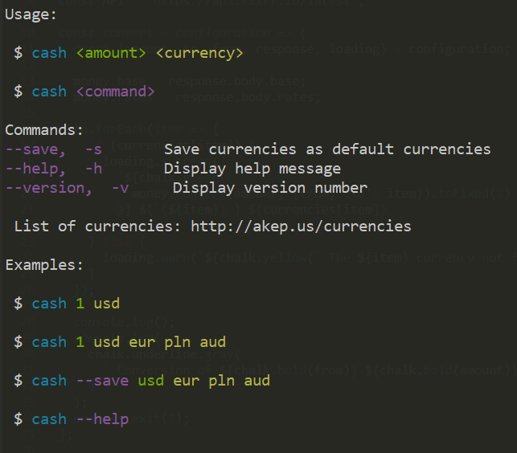

# Cash JS library

One of the best JS library to quick convert your currencies.

## Getting Started

These instructions will get you a copy of the project up and running on your local machine for development and testing purposes. See deployment for notes on how to deploy the project on a live system.

### Installing

To install the library using npm package manager  
```
npm install cash -g
```

### Usage

#### Help
You have access to all available commands using -h/--help option :
```
$cash --help
```



### Contributing

Please read [CONTRIBUTING.md](https://random.com) for details on our code of conduct, and the process for submitting pull requests to us.

### Authors

* **Karim Baali** - *Best Engineer Ever* - [GitHub](https://github.com/Kawiim)

See also the list of [contributors](https://random.com) who participated in this project.

### License

This project is licensed under the MIT License - see the [LICENSE.md](LICENSE.md) file for details.